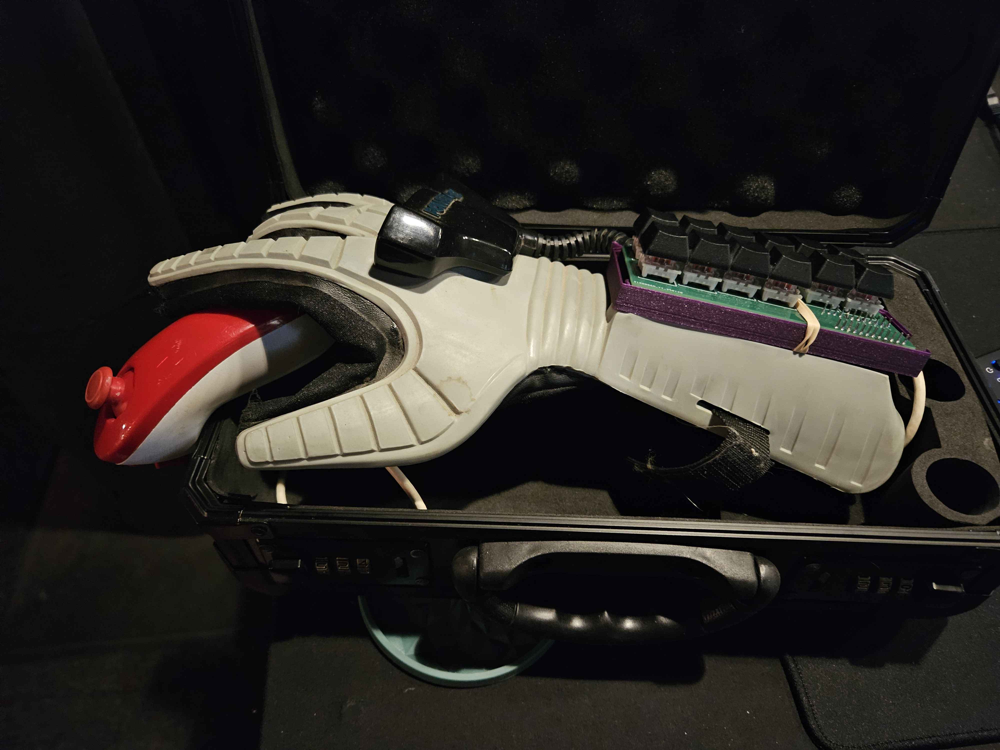

# Custom-Controller
Designed a custom controller for an NES Power Glove &amp; Wii Nunchuk, using a [SparkFun Pro Micro](https://www.sparkfun.com/pro-micro-5v-16mhz.html) as the microcontroller.

### Usage

Use the Arduino IDE software with the [XInput](https://github.com/dmadison/ArduinoXInput), and [Nunchuk](https://github.com/infusion/Fritzing/tree/master/Nunchuk) libraries. Honestly, I've forgotten the Arduino IDE + library setup, you will need to look into that

### Creation

I always had a dream that I could show up to a fighting game competition, and do decently well on the dumbest controller you could possibly imagine. I dreamed up a Nintendo Power Glove, which had the perfect number of buttons, and somehow, a Nintendo Wii's Nunchuk for movement. The only thing that could be worse is probably the [N64 Fishing Controller](https://share.google/wtuFq9j5mrwGsLFQ4), or worse, something that was half DDR Dance Mat.

I learned really early that it would take a lot of effort to actually make the real Power Glove controller work that way, way beyond what I know. Many of the buttons were closer to macros for the ~4 primary buttons (minus movement) the system uses. However, one day I saw a fightstick that was REALLY small... So I had a different plan.

Luckily for me, I knew how electricity worked. A closed circuit, the starting side on power and the ending side on ground, and if I had a button between it that can close the circuit, a light on that circuit will turn on. I learned that microcontrollers had pins that could read if a circuit was closed or open, which I figured could easily represent a button press. I then learned about microcontrollers, and that some of these have USBs that are used to control a peice of hardware, a Human Interface Device (HID). I looked into the idea more, got a board which I believe was the Pro Micro noted above, and created simple tests to see if I can easily press a button (I actually just touched 2 wires together) & print lines to console. It was really simple as that!

I then looked into the Nunchuk. I found a lot of resources online, but the one I utilized the most was [this website here](https://projecthub.arduino.cc/infusion/using-a-wii-nunchuk-with-arduino-5ec5b7). I learned a lot about the I2C protocol, had a friend help with annihilating the connector so I can wire it to my device, and luckily the library I was provided worked wonders! Aside from some joystick scaling issues, where the numerical value was extremely low compared to what I needed, so I found a close enough number to multiply it by, so that it was basically a full movement (if I multiplied it too high, the direction would invert! Fun debate on solving this with my friend). 

Finally, I found a website called [easyEDA](easyeda.com) which allowed me to design a beautiful custom circuit for my device, with layouts for keys built in (I bought a simple 2x6 keyboard to destroy for this project). 

I sent these to some PCB printing site, and within a few weeks I got my PCBs! What came next was the worst part, SOLDERING! The keys were extremely easy to solder, but the SparkFun Pro Micro required a small bit a solder to decide the voltage level, and I probably killed the first board I had trying to do it myself. My dad & sister saved the day, luckily! The nunchuk was easily able to solder into a [SparkFun Qwiic Adapter](https://www.sparkfun.com/sparkfun-qwiic-adapter.html). So I was able to combine it all & try it out! For which, it worked beautifully! Afterwards, I found a NES Power Glove controller case 3D print on [Thingiverse](thingiverse.com), modifed it to the PCB (lot of trial & error, requires a drill for screwing in), & we have the Funny Gadget!!

I learned on the Fighting Game tournament scene that it didn't work. Turns out, testing exclusively on Linux blinds me to the limitations of closed sourced operating systems. I learned about the XBox XInput API, and struggled with resetting my device every upload, but soon enough, I got there!!

Video of me playing with it at a local:
https://drive.google.com/file/d/1UI8M1-sQrYDWmRsa63sIt3KbqN_thSvK/view?usp=drive_link
